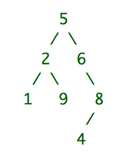

## 
Collection of Simple Interview/Challenge Tests

## Tic-Tac-Toe
The challenge: Code an algorithm that receives an array as input containing the current board of the game, with 'X' and 'O' being in the position they were played and '-' an available position, and '<>' the row separator. Returns the position for the next win, no matter 'X' or 'O', maintaining the position of the row separators.
* input: ["X","O","-","<>","-","O","-","<>","O","X","-"]
<pre>
X    O    -
-    O    -
O    X    -
</pre>
* Output expected: 2 (because 'O' wins playing in position 2).

Other examples
* Input: ["X","-","O","<>","-","-","O","<>","-","-","X"] / Output: 5
* Input: ["X","O","X","<>","-","O","O","<>","X","X","O"] / Output: 4
* 

## PreOrder Tree Traversal
The challenge: Code an algorithm the receives an array representing a binary tree and returns its preorder traversal with elements separated by a space.
* input:  ["5", "2", "6", "1", "9", "#", "8", "#", "#", "#", "#", "#", "#", "4", "#"]
  

* Output: '5 2 1 9 6 8 4'

  Other examples
* Input: ["4", "1", "5", "2", "#", "#", "#"] / Output: 4 1 2 5
* Input: ["2", "6", "#"] / Output: 2 6
* 

## Autores
| [ Diego Ferreira](https://github.com/diegonf) | 
| :---: |